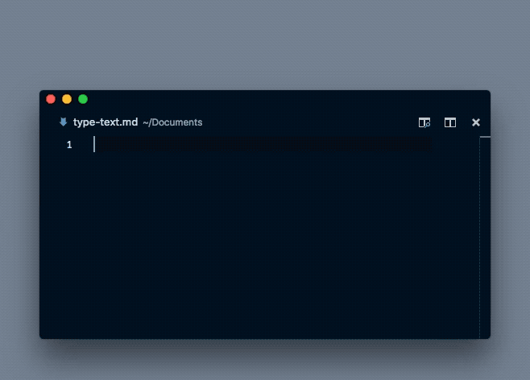

# Type Text Alfred Workflow

> [Alfred](https://www.alfredapp.com/) workflow to type the text from the clipboard into the currently focused text input field.

Made by 👨‍💻 [Florian Eckerstorfer](https://florian.ec) in 🎡 Vienna, Europe.

Occasionally I encounter a text field I can't paste text into. For example, some websites disable pasting into the _email confirmation_ input field. This Alfred workflow takes the clipboard and types it into the currently focused text field using Apple Script. In addition you can also type the text in the Alfred window.

You can download the latest version from the [releases page](https://github.com/florianeckerstorfer/alfred-type-text/releases).
